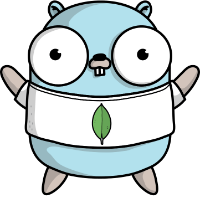

MongoDB Template
=================
<!--suppress ALL -->


[](https://github.com/GabrielHCataldo/go-mongo-template/releases/tag/v1.0.0)
[](https://goreportcard.com/report/github.com/GabrielHCataldo/go-mongo-template)
[](https://coveralls.io/github/GabrielHCataldo/go-mongo?branch=main)
[](https://www.codetriage.com/gabrielhcataldo/go-mongo)
[](https://mongodb.com/docs/drivers/go/current/)
[](https://github.com/mongodb/mongo-go-driver)
[](https://pkg.go.dev/github.com/GabrielHCataldo/go-mongo-template/mongo)


[//]: # ([![build workflow]&#40;https://github.com/GabrielHCataldo/go-mongo-template/actions/workflows/go.yml/badge.svg&#41;]&#40;https://github.com/GabrielHCataldo/go-mongo-template/actions&#41;)
[//]: # ([![Source graph]&#40;https://sourcegraph.com/github.com/go-mongo-template/mongo/-/badge.svg&#41;]&#40;https://sourcegraph.com/github.com/go-mongo-template/mongo?badge&#41;)
[//]: # ([![TODOs]&#40;https://badgen.net/https/api.tickgit.com/badgen/github.com/GabrielHCataldo/go-mongo-template/mongo&#41;]&#40;https://www.tickgit.com/browse?repo=github.com/GabrielHCataldo/go-mongo-template&#41;)

The go-mongo project came to facilitate the use of the mongo driver in your go project,
with self-management of sessions, simplicity in configuring the database and collection directly in the structure and
much more. See below some implemented features:

- Simplicity in function calls without having to use getDatabase and getCollection.
- Database and collection configuration directly in the structure.
- Autofill id generated when inserting the document.
- Automatic rollback if an error occurs during transactions in a session. (Optional)
- Ease of opening and closing sessions, and also aborting or committing transactions.
- Pre-developed functions such as **FindOneById**, **FindAll**, **FindPageable**, **Exists**, among others.
- Easy and intuitive pagination scheme.
- Predefined watch handler with automatic conversion and advanced customization.

Installation
------------

Use go get.

	go get github.com/GabrielHCataldo/go-mongo-template

Then import the go-mongo package into your own code.

```go
import "github.com/GabrielHCataldo/go-mongo-template/mongo"
```

Usability and documentation
------------
Below we will show some basic examples:

- [Insert](#insert)
- [Update](#update)
- [Replace](#replace)
- [Delete](#delete)
- [Find](#find)
- [Exists](#exists)
- [Count](#count)
- [Watch](#watch)

**IMPORTANT**: Always check the documentation in the structures and functions fields.
For more details on the examples, visit [All examples link](https://github/GabrielHCataldo/go-mongo-template/blob/main/_example).

## Insert

To insert a document, it's very simple, first let's configure a structure
To be able to work with go-mongo, see:

```go
package main

import "go.mongodb.org/mongo-driver/bson/primitive"

type test struct {
    Id        primitive.ObjectID `json:"id,omitempty" bson:"_id,omitempty" database:"test" collection:"test"`
    Random    int                `json:"random,omitempty" bson:"random,omitempty"`
    Name      string             `json:"name,omitempty" bson:"name,omitempty"`
    BirthDate primitive.DateTime `json:"birthDate,omitempty" bson:"birthDate,omitempty"`
    Emails    []string           `json:"emails,omitempty" bson:"emails,omitempty"`
    Balance   float64            `json:"balance,omitempty" bson:"balance,omitempty"`
    CreatedAt primitive.DateTime `json:"createdAt,omitempty" bson:"createdAt,omitempty"`
}
```

As shown in the structure above, it is important to continue, the **database** tags with the name
from your database and **collection** with the name of your collection. With this example structure
We were able to continue with the following interactions:

Insert a document into the collection see:

```go
package main

import (
    "context"
    "github.com/GabrielHCataldo/go-logger/logger"
    "github.com/GabrielHCataldo/go-mongo-template/mongo"
    "go.mongodb.org/mongo-driver/bson/primitive"
    "go.mongodb.org/mongo-driver/mongo/options"
    "math/rand"
    "os"
    "time"
)

func main() {
    ctx, cancel := context.WithTimeout(context.TODO(), 5*time.Second)
    defer cancel()
    mongoTemplate, err := mongo.NewTemplate(ctx, options.Client().ApplyURI(os.Getenv("MONGODB_URL")))
    if err != nil {
        logger.Error("error to init mongo template:", err)
        return
    }
	defer mongoTemplate.Disconnect(ctx)
    testDocument := test{
        Random:    rand.Int(),
        Name:      "Foo Bar",
        BirthDate: primitive.NewDateTimeFromTime(time.Date(1999, 1, 21, 0, 0, 0, 0, time.Local)),
        Emails:    []string{"foobar@gmail.com", "foobar3@hotmail.com"},
        Balance:   190.12,
        CreatedAt: primitive.NewDateTimeFromTime(time.Now()),
    }
    //new document need a pointer
    err = mongoTemplate.InsertOne(ctx, &testDocument)
    if err != nil {
        logger.Error("error insert document:", err)
    } else {
        logger.Info("document inserted successfully:", testDocument)
    }
}
```

Output:

    [INFO 2023/12/22 13:02:07] main.go:35: document inserted successfully: {"id":[101,133,178,255,197,19,21,77,11,38,26,152],"random":6628457526937947134,"name":"Foo Bar","birthDate":"1999-01-21T02:00:00Z","emails":["foobar@gmail.com","foobar3@hotmail.com"],"balance":190.12,"createdAt":"2023-12-22T16:02:07.322Z"}

We are able to insert multiple documents, remembering that if no ID is provided, and if you have
configured a field with annotation **bson** _id and the type is **primitive.ObjectId** we will fill in the
documents with identifiers generated by MongoDB, see:

```go
package main

import (
    "context"
    "github.com/GabrielHCataldo/go-logger/logger"
    "github.com/GabrielHCataldo/go-mongo-template/mongo"
    "github.com/GabrielHCataldo/go-mongo-template/mongo/option"
    "go.mongodb.org/mongo-driver/bson/primitive"
    "go.mongodb.org/mongo-driver/mongo/options"
    "math/rand"
    "os"
    "time"
)

func main() {
    ctx, cancel := context.WithTimeout(context.TODO(), 5*time.Second)
    defer cancel()
    mongoTemplate, err := mongo.NewTemplate(ctx, options.Client().ApplyURI(os.Getenv("MONGODB_URL")))
    if err != nil {
        logger.Error("error to init mongo template:", err)
        return
    }
	defer mongoTemplate.Disconnect(ctx)
    testDocuments := []*test{
        {
            Random:    rand.Int(),
            Name:      "Foo Bar",
            BirthDate: primitive.NewDateTimeFromTime(time.Date(1999, 1, 21, 0, 0, 0, 0, time.Local)),
            Emails:    []string{"foobar@gmail.com", "foobar3@hotmail.com"},
            Balance:   190.12,
            CreatedAt: primitive.NewDateTimeFromTime(time.Now()),
        },
        {
            Random:    rand.Int(),
            Name:      "Foo Bar 2",
            BirthDate: primitive.NewDateTimeFromTime(time.Date(1999, 1, 21, 0, 0, 0, 0, time.Local)),
            Emails:    []string{"foobar2@gmail.com", "foobar4@hotmail.com"},
            Balance:   290.12,
            CreatedAt: primitive.NewDateTimeFromTime(time.Now()),
        },
    }
    //new document need a slice of the pointer
    err = mongoTemplate.InsertMany(ctx, testDocuments)
    if err != nil {
        logger.Error("error insert document:", err)
    } else {
        logger.Info("document inserted successfully:", testDocuments)
    }
}
```

Output:

    [INFO 2023/12/22 16:11:33] main.go:46: document inserted successfully: [{"balance":190.12,"birthDate":"1999-01-21T02:00:00Z","createdAt":"2023-12-22T19:11:33.206Z","emails":["foobar@gmail.com","foobar3@hotmail.com"],"id":[101,133,223,101,71,229,174,223,115,181,143,210],"name":"Foo Bar","random":8094092400336225232},{"balance":290.12,"birthDate":"1999-01-21T02:00:00Z","createdAt":"2023-12-22T19:11:33.206Z","emails":["foobar2@gmail.com","foobar4@hotmail.com"],"id":[101,133,223,101,71,229,174,223,115,181,143,211],"name":"Foo Bar 2","random":4318945546650338065}]

For more insert examples visit [link](https://github/GabrielHCataldo/go-mongo-template/blob/main/_example/insert/main).

## Update

We will perform two simple update operations, see below using **UpdateOne**:

```go
package main

import (
    "context"
    "github.com/GabrielHCataldo/go-logger/logger"
    "github.com/GabrielHCataldo/go-mongo-template/mongo"
    "go.mongodb.org/mongo-driver/bson"
    "go.mongodb.org/mongo-driver/bson/primitive"
    "go.mongodb.org/mongo-driver/mongo/options"
    "os"
    "time"
)

func main() {
    ctx, cancel := context.WithTimeout(context.TODO(), 5*time.Second)
    defer cancel()
    mongoTemplate, err := mongo.NewTemplate(ctx, options.Client().ApplyURI(os.Getenv("MONGODB_URL")))
    if err != nil {
        logger.Error("error to init mongo template:", err)
        return
    }
    defer mongoTemplate.Disconnect(ctx)
    filter := bson.M{"_id": bson.M{"$exists": true}}
    update := bson.M{"$set": bson.M{"name": "Foo Bar Updated"}}
    updateResult, err := mongoTemplate.UpdateOne(ctx, filter, update, test{})
    if err != nil {
        logger.Error("error update document:", err)
    } else {
        logger.Info("document updated successfully:", updateResult)
    }
}
```

Output:

    [INFO 2023/12/22 16:29:23] main.go:29: document updated successfully: {"MatchedCount":1,"ModifiedCount":1,"UpsertedCount":0,"UpsertedID":null}

If you wanted to filter only with the document id, use the **UpdateOneById** function:

```go
package main

import (
    "context"
    "github.com/GabrielHCataldo/go-logger/logger"
    "github.com/GabrielHCataldo/go-mongo-template/mongo"
    "go.mongodb.org/mongo-driver/bson"
    "go.mongodb.org/mongo-driver/bson/primitive"
    "go.mongodb.org/mongo-driver/mongo/options"
    "os"
    "time"
)

func main() {
    ctx, cancel := context.WithTimeout(context.TODO(), 5*time.Second)
    defer cancel()
    mongoTemplate, err := mongo.NewTemplate(ctx, options.Client().ApplyURI(os.Getenv("MONGODB_URL")))
    if err != nil {
        logger.Error("error to init mongo template:", err)
        return
    }
    defer mongoTemplate.Disconnect(ctx)
    objectId, _ := primitive.ObjectIDFromHex("6585f3a8bf2af8ad9bcab912")
    update := bson.M{"$set": bson.M{"name": "Foo Bar Updated"}}
    updateResult, err := mongoTemplate.UpdateOneById(ctx, objectId, update, test{})
    if err != nil {
        logger.Error("error update document:", err)
    } else {
        logger.Info("document updated successfully:", updateResult)
    }
}
```

Output:

    [INFO 2023/12/22 17:47:00] main.go:29: document updated successfully: {"MatchedCount":1,"ModifiedCount":1,"UpsertedCount":0,"UpsertedID":null}

We can also use the **UpdateMany** function to update multiple documents, see
in the example below:

```go
package main

import (
    "context"
    "github.com/GabrielHCataldo/go-logger/logger"
    "github.com/GabrielHCataldo/go-mongo-template/mongo"
    "go.mongodb.org/mongo-driver/bson"
    "go.mongodb.org/mongo-driver/bson/primitive"
    "go.mongodb.org/mongo-driver/mongo/options"
    "os"
    "time"
)

func main() {
    ctx, cancel := context.WithTimeout(context.TODO(), 5*time.Second)
    defer cancel()
    mongoTemplate, err := mongo.NewTemplate(ctx, options.Client().ApplyURI(os.Getenv("MONGODB_URL")))
    if err != nil {
        logger.Error("error to init mongo template:", err)
        return
    }
    defer mongoTemplate.Disconnect(ctx)
    filter := bson.M{"_id": bson.M{"$exists": true}}
    update := bson.M{"$set": bson.M{"name": "Foo Bar Updated"}}
    updateResult, err := mongoTemplate.UpdateOne(ctx, filter, update, test{})
    if err != nil {
        logger.Error("error update documents:", err)
    } else {
        logger.Info("document updated successfully:", updateResult)
    }
}
```

Output:

    [INFO 2023/12/22 16:31:41] main.go:29: document updated successfully: {"MatchedCount":13,"ModifiedCount":13,"UpsertedCount":0,"UpsertedID":null}

For more update examples visit [link](https://github/GabrielHCataldo/go-mongo-template/blob/main/_example/update/main).

## Replace

To replace a document, see the example below:

```go
package main

import (
    "context"
    "github.com/GabrielHCataldo/go-logger/logger"
    "github.com/GabrielHCataldo/go-mongo-template/mongo"
    "go.mongodb.org/mongo-driver/bson"
    "go.mongodb.org/mongo-driver/bson/primitive"
    "go.mongodb.org/mongo-driver/mongo/options"
    "math/rand"
    "os"
    "time"
)

func main() {
    ctx, cancel := context.WithTimeout(context.TODO(), 5*time.Second)
    defer cancel()
    mongoTemplate, err := mongo.NewTemplate(ctx, options.Client().ApplyURI(os.Getenv("MONGODB_URL")))
    if err != nil {
        logger.Error("error to init mongo template:", err)
        return
    }
    defer mongoTemplate.Disconnect(ctx)
    filter := bson.M{"_id": bson.M{"$exists": true}}
    replacement := test{
        Random:    rand.Int(),
        Name:      "Foo Bar",
        BirthDate: primitive.NewDateTimeFromTime(time.Date(1999, 1, 21, 0, 0, 0, 0, time.Local)),
        Emails:    []string{"foobar@gmail.com", "foobar3@hotmail.com"},
        Balance:   190.12,
        CreatedAt: primitive.NewDateTimeFromTime(time.Now()),
    }
    updateResult, err := mongoTemplate.ReplaceOne(ctx, filter, replacement, test{})
    if err != nil {
        logger.Error("error replace document:", err)
    } else {
        logger.Info("document replaced successfully:", updateResult)
    }
}
```

Output:

    [INFO 2023/12/22 17:21:49] main.go:37: document replaced successfully: {"MatchedCount":1,"ModifiedCount":1,"UpsertedCount":0,"UpsertedID":null}

For more replace examples visit [link](https://github/GabrielHCataldo/go-mongo-template/blob/main/_example/replace/main).

## Delete

Let's start by removing just one document using the simple filter, see below:

```go
package main

import (
    "context"
    "github.com/GabrielHCataldo/go-logger/logger"
    "github.com/GabrielHCataldo/go-mongo-template/mongo"
    "go.mongodb.org/mongo-driver/bson"
    "go.mongodb.org/mongo-driver/bson/primitive"
    "go.mongodb.org/mongo-driver/mongo/options"
    "os"
    "time"
)

func main() {
    ctx, cancel := context.WithTimeout(context.TODO(), 5*time.Second)
    defer cancel()
    mongoTemplate, err := mongo.NewTemplate(ctx, options.Client().ApplyURI(os.Getenv("MONGODB_URL")))
    if err != nil {
        logger.Error("error to init mongo template:", err)
        return
    }
    defer mongoTemplate.Disconnect(ctx)
    filter := bson.M{"_id": bson.M{"$exists": true}}
    deleteResult, err := mongoTemplate.DeleteOne(ctx, filter, test{})
    if err != nil {
        logger.Error("error delete document:", err)
    } else {
        logger.Info("document deleted successfully:", deleteResult)
    }
}
```

Output:

    [INFO 2023/12/22 17:38:06] main.go:53: document deleted successfully: {"DeletedCount":1}

Podemos remover um documento pelo id passando como parametro como no exemplo abaixo:

```go
package main

import (
    "context"
    "github.com/GabrielHCataldo/go-logger/logger"
    "github.com/GabrielHCataldo/go-mongo-template/mongo"
    "go.mongodb.org/mongo-driver/bson"
    "go.mongodb.org/mongo-driver/bson/primitive"
    "go.mongodb.org/mongo-driver/mongo/options"
    "os"
    "time"
)

func main() {
    ctx, cancel := context.WithTimeout(context.TODO(), 5*time.Second)
    defer cancel()
    mongoTemplate, err := mongo.NewTemplate(ctx, options.Client().ApplyURI(os.Getenv("MONGODB_URL")))
    if err != nil {
        logger.Error("error to init mongo template:", err)
        return
    }
    defer mongoTemplate.Disconnect(ctx)
    objectId, _ := primitive.ObjectIDFromHex("6585f3a8bf2af8ad9bcab912")
    deleteResult, err := mongoTemplate.DeleteOneById(ctx, objectId, test{})
    if err != nil {
        logger.Error("error delete document:", err)
    } else {
        logger.Info("document deleted successfully:", deleteResult)
    }
}
```

Output:

    [INFO 2023/12/22 17:41:50] main.go:28: document deleted successfully: {"DeletedCount":1}

And finally, we can remove several documents using the indicated filter:

```go
package main

import (
    "context"
    "github.com/GabrielHCataldo/go-logger/logger"
    "github.com/GabrielHCataldo/go-mongo-template/mongo"
    "go.mongodb.org/mongo-driver/bson"
    "go.mongodb.org/mongo-driver/bson/primitive"
    "go.mongodb.org/mongo-driver/mongo/options"
    "os"
    "time"
)

func main() {
    ctx, cancel := context.WithTimeout(context.TODO(), 5*time.Second)
    defer cancel()
    mongoTemplate, err := mongo.NewTemplate(ctx, options.Client().ApplyURI(os.Getenv("MONGODB_URL")))
    if err != nil {
        logger.Error("error to init mongo template:", err)
        return
    }
    defer mongoTemplate.Disconnect(ctx)
    filter := bson.M{"_id": bson.M{"$exists": true}}
    deleteResult, err := mongoTemplate.DeleteMany(ctx, filter, test{})
    if err != nil {
        logger.Error("error delete documents:", err)
    } else {
        logger.Info("documents deleted successfully:", deleteResult)
    }
}
```

Output

    [INFO 2023/12/22 17:50:01] main.go:28: documents deleted successfully: {"DeletedCount":8}

For more delete examples visit [link](https://github/GabrielHCataldo/go-mongo-template/blob/main/_example/delete/main).

## Find

Obtaining all the documents is very simple, see the example below:

```go
package main

import (
    "context"
    "github.com/GabrielHCataldo/go-logger/logger"
    "github.com/GabrielHCataldo/go-mongo-template/mongo"
    "go.mongodb.org/mongo-driver/bson/primitive"
    "os"
    "time"
)

func main() {
    ctx, cancel := context.WithTimeout(context.TODO(), 5*time.Second)
    defer cancel()
    mongoTemplate, err := mongo.NewTemplate(ctx, options.Client().ApplyURI(os.Getenv("MONGODB_URL")))
    if err != nil {
        logger.Error("error to init mongo template:", err)
        return
    }
    defer mongoTemplate.Disconnect(ctx)
    //dest need a pointer
    var dest []test
    err = mongoTemplate.FindAll(ctx, &dest)
    if err != nil {
        logger.Error("error find all documents:", err)
    } else {
        logger.Info("find all documents successfully:", dest)
    }
}
```

Output:

    [INFO 2023/12/22 17:02:22] main.go:28: find all documents successfully: [{"balance":190.12,"birthDate":"1999-01-21T02:00:00Z","createdAt":"2023-12-22T18:53:26.695Z","emails":["foobar@gmail.com","foobar3@hotmail.com"],"id":[101,133,219,38,99,62,34,92,190,173,245,83],"name":"Foo Bar Updated","random":2576121145493409319},{"balance":190.12,"birthDate":"1999-01-21T02:00:00Z","createdAt":"2023-12-22T19:11:33.206Z","emails":["foobar@gmail.com","foobar3@hotmail.com"],"id":[101,133,223,101,71,229,174,223,115,181,143,210],"name":"Foo Bar","random":8094092400336225232},{"balance":290.12,"birthDate":"1999-01-21T02:00:00Z","createdAt":"2023-12-22T19:11:33.206Z","emails":["foobar2@gmail.com","foobar4@hotmail.com"],"id":[101,133,223,101,71,229,174,223,115,181,143,211],"name":"Foo Bar 2","random":4318945546650338065}]

Be able to page in a simple and intuitive way, see:

```go
package main

import (
    "context"
    "github.com/GabrielHCataldo/go-logger/logger"
    "github.com/GabrielHCataldo/go-mongo-template/mongo"
    "go.mongodb.org/mongo-driver/bson"
    "go.mongodb.org/mongo-driver/bson/primitive"
    "go.mongodb.org/mongo-driver/mongo/options"
    "os"
    "time"
)

func main() {
    ctx, cancel := context.WithTimeout(context.TODO(), 5*time.Second)
    defer cancel()
    mongoTemplate, err := mongo.NewTemplate(ctx, options.Client().ApplyURI(os.Getenv("MONGODB_URL")))
    if err != nil {
        logger.Error("error to init mongo template:", err)
        return
    }
    defer mongoTemplate.Disconnect(ctx)
    filter := bson.M{"_id": bson.M{"$exists": true}}
    pageOutput, err := mongoTemplate.FindPageable(ctx, filter, mongo.PageInput{
        Page:     0,
        PageSize: 10,
        Ref:      []test{}, //need a slice of the structure
        Sort:     bson.M{"createdAt": mongo.SortDesc},
    })
    if err != nil {
        logger.Error("error find pageable documents:", err)
    } else {
        logger.Info("find pageable documents successfully:", pageOutput)
    }
}
```

Output:

    [INFO 2023/12/22 18:04:54] main.go:33: find pageable documents successfully: {"page":0,"pageSize":10,"pageTotal":2,"totalElements":16,"content":[{"balance":190.12,"birthDate":"1999-01-21T02:00:00Z","createdAt":"2023-12-22T21:03:03.589Z","emails":["foobar@gmail.com","foobar3@hotmail.com"],"id":[101,133,249,135,99,77,8,140,0,92,121,166],"name":"Foo Bar","random":9062939652073059162},{"balance":290.12,"birthDate":"1999-01-21T02:00:00Z","createdAt":"2023-12-22T21:03:03.288Z","emails":["foobar2@gmail.com","foobar4@hotmail.com"],"id":[101,133,249,135,99,77,8,140,0,92,121,164],"name":"Foo Bar 2","random":3964041099041384637},{"balance":190.12,"birthDate":"1999-01-21T02:00:00Z","createdAt":"2023-12-22T21:03:03.288Z","emails":["foobar@gmail.com","foobar3@hotmail.com"],"id":[101,133,249,135,99,77,8,140,0,92,121,163],"name":"Foo Bar","random":7118470983031370710},{"balance":190.12,"birthDate":"1999-01-21T02:00:00Z","createdAt":"2023-12-22T21:03:02.895Z","emails":["foobar@gmail.com","foobar3@hotmail.com"],"id":[101,133,249,134,99,77,8,140,0,92,121,161],"name":"Foo Bar","random":685662021554519416},{"balance":290.12,"birthDate":"1999-01-21T02:00:00Z","createdAt":"2023-12-22T21:03:02.032Z","emails":["foobar2@gmail.com","foobar4@hotmail.com"],"id":[101,133,249,134,109,6,181,94,237,141,156,103],"name":"Foo Bar 2","random":4825201869427500545},{"balance":190.12,"birthDate":"1999-01-21T02:00:00Z","createdAt":"2023-12-22T21:03:02.032Z","emails":["foobar@gmail.com","foobar3@hotmail.com"],"id":[101,133,249,134,109,6,181,94,237,141,156,102],"name":"Foo Bar","random":5424075018439786230},{"balance":190.12,"birthDate":"1999-01-21T02:00:00Z","createdAt":"2023-12-22T21:03:01.71Z","emails":["foobar@gmail.com","foobar3@hotmail.com"],"id":[101,133,249,133,109,6,181,94,237,141,156,100],"name":"Foo Bar","random":4901802038316432856},{"balance":190.12,"birthDate":"1999-01-21T02:00:00Z","createdAt":"2023-12-22T20:46:48.598Z","emails":["foobar@gmail.com","foobar3@hotmail.com"],"id":[101,133,245,184,253,143,169,125,86,36,25,247],"name":"Foo Bar","random":5045147651911492796},{"balance":290.12,"birthDate":"1999-01-21T02:00:00Z","createdAt":"2023-12-22T20:46:48.262Z","emails":["foobar2@gmail.com","foobar4@hotmail.com"],"id":[101,133,245,184,253,143,169,125,86,36,25,245],"name":"Foo Bar 2","random":5267773685750720182},{"balance":190.12,"birthDate":"1999-01-21T02:00:00Z","createdAt":"2023-12-22T20:46:48.262Z","emails":["foobar@gmail.com","foobar3@hotmail.com"],"id":[101,133,245,184,253,143,169,125,86,36,25,244],"name":"Foo Bar","random":6973387066252926888}],"lastQueryAt":"2023-12-22T21:04:54Z"}

Also obtain a single document by id, see below:

```go
package main

import (
    "context"
    "github.com/GabrielHCataldo/go-logger/logger"
    "github.com/GabrielHCataldo/go-mongo-template/mongo"
    "go.mongodb.org/mongo-driver/bson/primitive"
    "go.mongodb.org/mongo-driver/mongo/options"
    "os"
    "time"
)

func main() {
    ctx, cancel := context.WithTimeout(context.TODO(), 5*time.Second)
    defer cancel()
    mongoTemplate, err := mongo.NewTemplate(ctx, options.Client().ApplyURI(os.Getenv("MONGODB_URL")))
    if err != nil {
        logger.Error("error to init mongo template:", err)
        return
    }
    defer mongoTemplate.Disconnect(ctx)
    objectId, _ := primitive.ObjectIDFromHex("6585db26633e225cbeadf553")
    //dest need a pointer
    var dest test
    err = mongoTemplate.FindOneById(ctx, objectId, &dest)
    if err != nil {
        logger.Error("error find all documents:", err)
    } else {
        logger.Info("find by id document successfully:", dest)
    }
}
```

Output:

    [INFO 2023/12/22 17:14:47] main.go:29: find by id document successfully: {"id":[101,133,219,38,99,62,34,92,190,173,245,83],"random":2576121145493409319,"name":"Foo Bar Updated","birthDate":"1999-01-21T02:00:00Z","emails":["foobar@gmail.com","foobar3@hotmail.com"],"balance":190.12,"createdAt":"2023-12-22T18:53:26.695Z"}

For more find examples visit [link](https://github/GabrielHCataldo/go-mongo-template/blob/main/_example/find/main).

## Exists

Check if the document exists by id:

```go
package main

import (
    "context"
    "github.com/GabrielHCataldo/go-logger/logger"
    "github.com/GabrielHCataldo/go-mongo-template/mongo"
    "go.mongodb.org/mongo-driver/bson/primitive"
    "go.mongodb.org/mongo-driver/mongo/options"
    "os"
    "time"
)

func main() {
    ctx, cancel := context.WithTimeout(context.TODO(), 5*time.Second)
    defer cancel()
    mongoTemplate, err := mongo.NewTemplate(ctx, options.Client().ApplyURI(os.Getenv("MONGODB_URL")))
    if err != nil {
        logger.Error("error to init mongo template:", err)
        return
    }
    defer mongoTemplate.Disconnect(ctx)
    objectId, _ := primitive.ObjectIDFromHex("6585f5b8fd8fa97d562419f7")
    exists, err := mongoTemplate.ExistsById(ctx, objectId, test{})
    if err != nil {
        logger.Error("error check exists document:", err)
    } else {
        logger.Info("document exists:", exists)
    }
}
```

Output:

    [INFO 2023/12/22 17:56:24] main.go:27: document exists: true

Check if the document exists using the filter:

```go
package main

import (
    "context"
    "github.com/GabrielHCataldo/go-logger/logger"
    "github.com/GabrielHCataldo/go-mongo-template/mongo"
    "go.mongodb.org/mongo-driver/bson"
    "go.mongodb.org/mongo-driver/bson/primitive"
    "go.mongodb.org/mongo-driver/mongo/options"
    "os"
    "time"
)

func main() {
    ctx, cancel := context.WithTimeout(context.TODO(), 5*time.Second)
    defer cancel()
    mongoTemplate, err := mongo.NewTemplate(ctx, options.Client().ApplyURI(os.Getenv("MONGODB_URL")))
    if err != nil {
        logger.Error("error to init mongo template:", err)
        return
    }
    defer mongoTemplate.Disconnect(ctx)
    filter := bson.M{"_id": bson.M{"$exists": true}}
    exists, err := mongoTemplate.Exists(ctx, filter, test{})
    if err != nil {
        logger.Error("error check exists document:", err)
    } else {
        logger.Info("document exists:", exists)
    }
}
```

Output:

    [INFO 2023/12/22 17:57:46] main.go:28: document exists: true

For more examples of exists visit [link](https://github/GabrielHCataldo/go-mongo-template/blob/main/_example/exists/main).

## Count

We start with the total counter, see:

```go
package main

import (
    "context"
    "github.com/GabrielHCataldo/go-logger/logger"
    "github.com/GabrielHCataldo/go-mongo-template/mongo"
    "go.mongodb.org/mongo-driver/bson"
    "go.mongodb.org/mongo-driver/bson/primitive"
    "go.mongodb.org/mongo-driver/mongo/options"
    "os"
    "time"
)

func main() {
    ctx, cancel := context.WithTimeout(context.TODO(), 5*time.Second)
    defer cancel()
    mongoTemplate, err := mongo.NewTemplate(ctx, options.Client().ApplyURI(os.Getenv("MONGODB_URL")))
    if err != nil {
        logger.Error("error to init mongo template:", err)
        return
    }
    defer mongoTemplate.Disconnect(ctx)
    countResult, err := mongoTemplate.EstimatedDocumentCount(ctx, test{})
    if err != nil {
        logger.Error("error estimated document count:", err)
    } else {
        logger.Info("estimated document count successfully:", countResult)
    }
}
```

Output:

    [INFO 2023/12/22 18:26:44] main.go:27: estimated document count successfully: 16

You can also count the documents using the filter:

```go
package main

import (
    "context"
    "github.com/GabrielHCataldo/go-logger/logger"
    "github.com/GabrielHCataldo/go-mongo-template/mongo"
    "go.mongodb.org/mongo-driver/bson"
    "go.mongodb.org/mongo-driver/bson/primitive"
    "go.mongodb.org/mongo-driver/mongo/options"
    "os"
    "time"
)

func main() {
    ctx, cancel := context.WithTimeout(context.TODO(), 5*time.Second)
    defer cancel()
    mongoTemplate, err := mongo.NewTemplate(ctx, options.Client().ApplyURI(os.Getenv("MONGODB_URL")))
    if err != nil {
        logger.Error("error to init mongo template:", err)
        return
    }
    defer mongoTemplate.Disconnect(ctx)
    filter := bson.M{"_id": bson.M{"$exists": true}}
    countResult, err := mongoTemplate.CountDocuments(ctx, filter, test{})
    if err != nil {
        logger.Error("error count documents:", err)
    } else {
        logger.Info("count documents successfully:", countResult)
    }
}
```

Output:

    [INFO 2023/12/22 18:23:47] main.go:28: count documents successfully: 10

## Watch

To watch the operations we highlight the **WatchHandler**, where it will persist the searches and
will convert the received data, transforming it into a **ContextWatch** where it will have all the necessary data, then
After the conversion, we call the function informed in the function parameter, see a basic example:

```go
package main

import (
    "context"
    "github.com/GabrielHCataldo/go-logger/logger"
    "github.com/GabrielHCataldo/go-mongo-template/mongo"
    "github.com/GabrielHCataldo/go-mongo-template/mongo/option"
    "go.mongodb.org/mongo-driver/bson"
    "go.mongodb.org/mongo-driver/bson/primitive"
    "go.mongodb.org/mongo-driver/mongo/options"
    "os"
    "time"
)

func main() {
    ctx, cancel := context.WithTimeout(context.TODO(), 5*time.Second)
    defer cancel()
    mongoTemplate, err := mongo.NewTemplate(ctx, options.Client().ApplyURI(os.Getenv("MONGODB_URL")))
    if err != nil {
        logger.Error("error to init mongo template:", err)
        return
    }
    defer mongoTemplate.Disconnect(ctx)
    pipeline := mongo.Pipeline{bson.D{{"$match", bson.D{
        {"operationType", bson.M{"$in": []string{"insert", "update", "delete", "replace"}}},
    }}}}
    err = mongoTemplate.WatchHandler(context.TODO(), pipeline, handler, option.NewWatchHandler().SetDatabaseName("test"))
    if err != nil {
        logger.Error("error watch handler:", err)
    } else {
        logger.Info("watch handler complete successfully")
    }
}

func handler(ctx *mongo.ContextWatch) {
    logger.Info("handler watch called:", ctx)
}
```

Output:

    [INFO 2023/12/22 18:39:42] main.go:36: handler watch called: {"Event":{"ClusterTime":{"I":5,"T":1703281182},"DocumentKey":{"ID":[101,134,2,30,136,59,150,210,55,170,55,135]},"FullDocument":{"_id":[101,134,2,30,136,59,150,210,55,170,55,135],"balance":190.12,"birthDate":"1999-01-21T02:00:00Z","createdAt":"2023-12-22T21:39:42.288Z","emails":["foobar@gmail.com","foobar3@hotmail.com"],"name":"Foo Bar","random":2217047455415420974},"NS":{"Coll":"test","DB":"test"},"OperationType":"insert","UpdateDescription":{"RemovedFields":null,"TruncatedArrays":null,"UpdatedFields":null}}}
    [INFO 2023/12/22 18:42:51] main.go:36: handler watch called: {"Event":{"ClusterTime":{"I":9,"T":1703281182},"DocumentKey":{"ID":[101,134,2,30,136,59,150,210,55,170,55,137]},"FullDocument":{"_id":[101,134,2,30,136,59,150,210,55,170,55,137],"balance":190.12,"birthDate":"1999-01-21T02:00:00Z","createdAt":"2023-12-22T21:39:42.627Z","emails":["foobar@gmail.com","foobar3@hotmail.com"],"name":"Foo Bar","random":2251712412936242638},"NS":{"Coll":"test","DB":"test"},"OperationType":"insert","UpdateDescription":{"RemovedFields":null,"TruncatedArrays":null,"UpdatedFields":null}}}
    Process finished with the exit code 130 (interrupted by signal 2:SIGINT)

For more watch examples visit [link](https://github/GabrielHCataldo/go-mongo-template/blob/main/_example/watch/main).

## Other Examples

Below are some examples that were not shown or cited:

- [Aggregate](https://github/GabrielHCataldo/go-mongo-template/blob/main/_example/aggregate/main)
- [Distinct](https://github/GabrielHCataldo/go-mongo-template/blob/main/_example/distinct/main)
- [Watch](https://github/GabrielHCataldo/go-mongo-template/blob/main/_example/watch/main)
- [Drop](https://github/GabrielHCataldo/go-mongo-template/blob/main/_example/drop/main)
- [Indexes](https://github/GabrielHCataldo/go-mongo-template/blob/main/_example/indexes/main)
- [Handler Session and Transaction](https://github/GabrielHCataldo/go-mongo-template/blob/main/_example/session/main)

How to contribute
------
Make a pull request, or if you find a bug, open it
an Issues.

License
-------
Distributed under MIT license, see the license file within the code for more details.